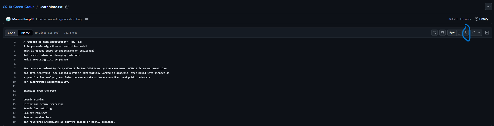

# CS110-Green-Group
Group project for CS110
Members: Marcus Sharp, Riley Odell-Dee, Ryan Gronberg

###WMD Identifier
This app will allow users to Check on if they are potentially a victim of a WMD. 

###Overview:
We wanted to spread awareness on what a WMD is and why it is important to be aware of them. Our reason for this is because there are many people who are discriminated against by WMD's, especially those who are historically underrepresented. People who live in  low income housing are also often victims of WMDs. 

###Information:
Since WMDs are so widespread it is important to spread awareness. This is because if no one is aware then companies are able to use these WMDs to discriminate and reinforce inequality. If enough people learn about what a WMD is then we may be able to start getting rid of them and making a positive impact on society.

###Configuration, installation, and execution instructions:
Download both the LearnMore.txt and Main.py files from this repository. Next open python and open the Main.py file. Make sure that LearnMore.txt and Main.py are in the same folder. Run the program and decide on if you want to learn more about WMDs or if you want to go through the questionnaire to see if you are a potential victim of a WMD.

###Sample use-cases with screenshots:

Click the download button and add it to a folder.

Click LearnMore.txt

Click the download button and add it to the same folder as Main.py

Open your code editor I am using Mu and click load

Load the main.py file
Click Run

This will open up the app where you can click Start to fill out the Questionare

Or you can Click Learn More to learn about WMD’s

There is a link to the book weapons of math destruction

###Table of files including:
Main.py (Created by Marcus):
This is the GUI and questionnaire allowing the user to answer questions and learn if they are a victim of a WMD. The questionnaire is when the user presses the Start button. When the user presses the Learn More button it takes the user to the learn more page where you can read about what a WMD is and has a link to a PDF file of the book Weapons of Math Destruction by Cathy O’neil.
LearnMore.txt (updated by Riley):
This is the text file where you can learn more about what a WMD is.

###Citations:
O’Neil, Cathy. Weapons of Math Destruction: How Big Data Increases Inequality and Threatens Democracy. Random House UK, 2022.
